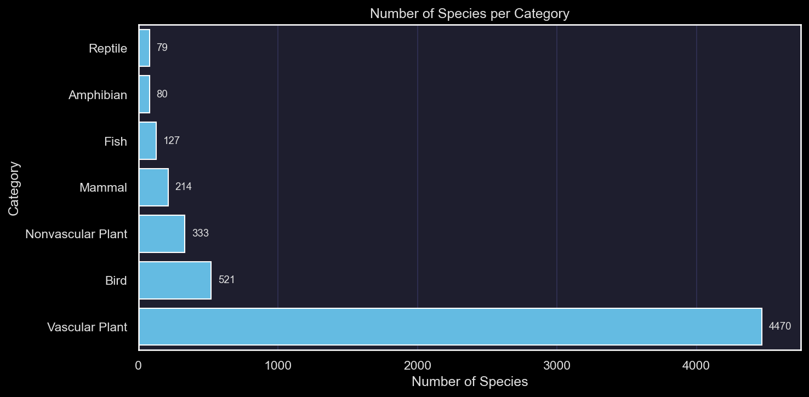
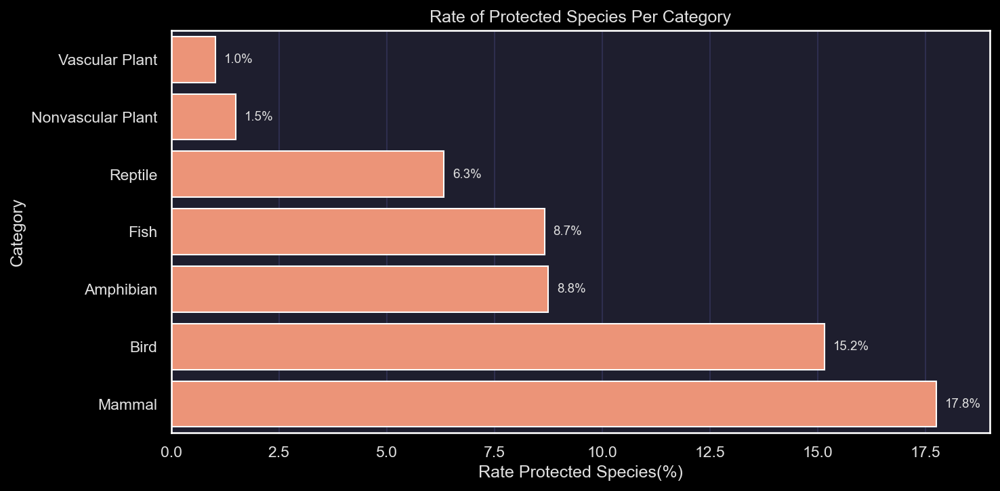
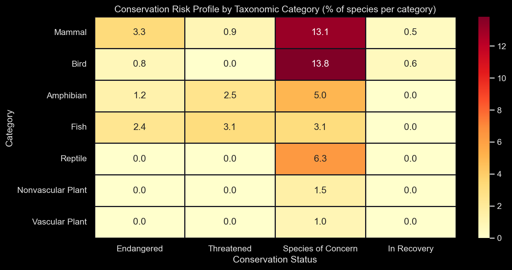
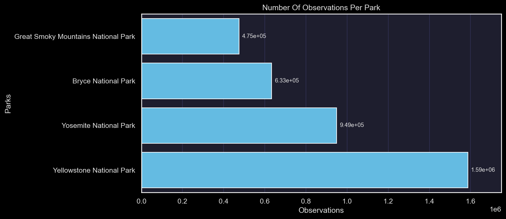
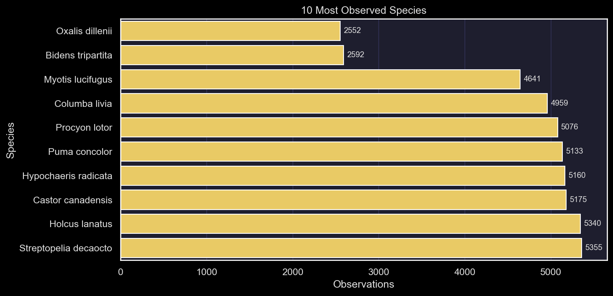
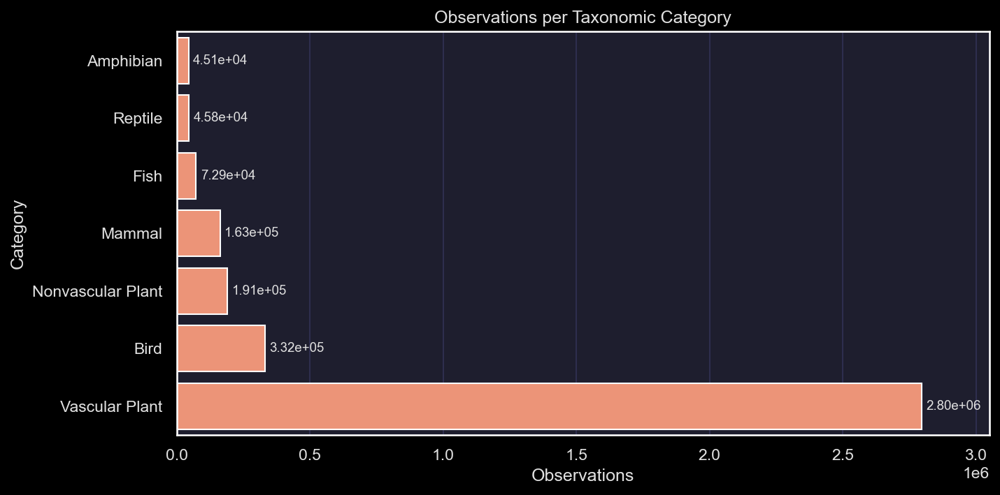

# Biodiversity in National Parks
### Statistical Analysis of Species Conservation Status


---

## Overview

This project analyzes biodiversity data from the **National Park Service (NPS)**, focusing on the conservation status of species across four major U.S. national parks. The analysis goes beyond descriptive statistics to include **formal hypothesis testing** — determining whether certain taxonomic groups are statistically more likely to carry an active conservation status.

This notebook is part of a Data Science portfolio. The full analysis is written in English for international visibility.

---

## Research Questions

1. What is the distribution of conservation status across taxonomic categories?
2. Are certain taxonomic groups statistically more likely to be protected?
3. Which species and parks show the highest observation activity, and does this align with conservation risk?

---

## Dataset

Two CSV files provided by the National Park Service:

| File | Description | Rows |
|---|---|---|
| `species_info.csv` | Species taxonomy and conservation status | 5,824 |
| `observations.csv` | Species sightings across 4 national parks (last 7 days) | 23,296 |

**Parks covered:** Yellowstone, Yosemite, Bryce Canyon, Great Smoky Mountains  
**Taxonomic categories:** Vascular Plant, Bird, Nonvascular Plant, Mammal, Fish, Amphibian, Reptile  
**Conservation statuses:** No Concern, Species of Concern, Threatened, Endangered, In Recovery

---

## Project Structure

```
biodiversity-national-parks/
│
├── biodiversity.ipynb       # Main analysis notebook
├── species_info.csv         # Species taxonomy and conservation data
├── observations.csv         # Park observation records
└── README.md
```

---

## Methodology

### 1. Data Loading & Exploration
Initial inspection of both datasets: shape, data types, missing values, and unique value distributions. Key finding: **96.7% of species (5,633 out of 5,824) have no recorded conservation status** — treated as *No Concern* throughout the analysis, not as missing data.



### 2. Conservation Status Analysis
Feature engineering: creation of `conservation_status_clean` (NaN → *No Concern*) and `is_protected` (boolean flag). Analysis of protection rates by taxonomic category, both in absolute terms and as proportions.




### 3. Statistical Significance Testing
**Chi-square test of independence** to determine whether taxonomic category and conservation status are statistically related. **Cramér's V** computed as a measure of effect size.

| Metric | Value |
|---|---|
| χ² statistic | 469.51 |
| p-value | 3.10 × 10⁻⁹⁸ |
| Degrees of freedom | 6 |
| Cramér's V | 0.28 (weak effect) |

The result is highly significant — taxonomic category and protection status are **not independent**. However, the weak effect size (V = 0.28) indicates that category alone is not a strong predictor of conservation status, suggesting additional factors (habitat size, species visibility, funding) play a relevant role.

### 4. Species Observations Across Parks
Merge of both datasets on `scientific_name` (inner join, zero data loss verified). Analysis of observation volume by park, by species (top 10), and by taxonomic category.





---

## Key Findings

- **Mammals and Birds** carry the highest conservation burden: **17.8%** and **15.2%** of their respective species hold an active conservation status — roughly 10× more than either plant category.
- Prioritizing by **Endangered** status: Mammals (3.3%), Fish (2.4%), and Amphibians (1.2%) are the most critical groups.
- **Yellowstone National Park** accounts for **43.6%** of all observations across the four parks.
- Despite **Vascular Plants** being the most observed taxonomic category, only **1.0%** of their species carry an active conservation status. This may reflect a *Plant Blindness* monitoring gap rather than genuine low risk.
- The Chi-square test confirms a statistically significant relationship between taxonomic category and conservation status, though the weak Cramér's V (0.28) suggests the category is not a sufficient predictor on its own.

---

## Recommendations

- **Investigate plant monitoring gaps:** Cross-validate NaN values in `conservation_status` against official NPS records to confirm whether absence of status genuinely indicates no concern, or reflects an observational blind spot.
- **Enrich the dataset with habitat features:** Include habitat size and a proxy for species visibility. Differences in observation counts may reflect habitat availability in the studied parks rather than actual species abundance.
- **Expand the geographic scope:** Data from only 4 parks limits generalizability. A nationally representative sample of parks — covering diverse ecosystems — would allow more robust conclusions about U.S. biodiversity conservation priorities.

---

## Limitations

- The observation data covers only a **7-day window**, which may not be representative of long-term species presence.
- The study is limited to **4 national parks**, all in the USA. Results cannot be generalized to other ecosystems or countries.
- The `NaN` values in `conservation_status` are treated as *No Concern*, but the dataset does not confirm this interpretation explicitly.
- Taxonomic category explains only a fraction of the variance in conservation status (Cramér's V = 0.28). Factors outside this dataset — funding, political priorities, species charisma — likely play a significant role.

---

## Tools & Libraries

- **Python 3.10**
- `pandas` — data manipulation and aggregation
- `numpy` — numerical operations
- `matplotlib` / `seaborn` — visualization (dark mode theme)
- `scipy.stats` — chi-square test of independence

---

## Author

**Óscar Jover Arrate**  
Data Scientist · PhD in Physics · 
[GitHub](https://github.com/skrarte96) · [LinkedIn](https://linkedin.com/in/óscar-jover-arrate-050135163) · oscarja96@gmail.com
